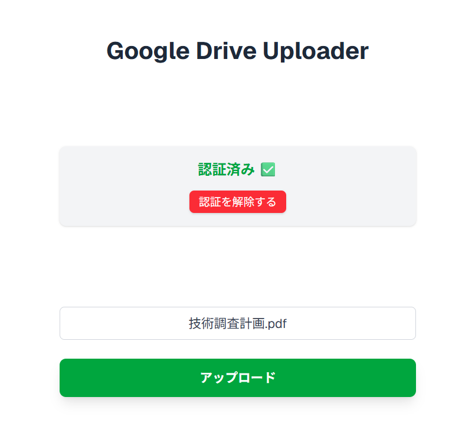

# DriveUploader

DriveUploader は、ブラウザを通じてファイルをアップロードし、Google Drive に送信するアプリケーションです。簡単な操作でファイルをクラウドに保存し、共有することができます。

## 主な機能

- **ブラウザアップロード**: ブラウザから選択したファイルを Google Drive にアップロード。
- **フォルダ管理**: アップロード先フォルダをカスタマイズ可能。
- **セキュリティ**: Google OAuth 2.0 を使用した安全な認証。

## 必要条件

- Google アカウント
- Node.js 16 以上
- npm または yarn

### 🔁 フロー概要

1. ユーザーが Web アプリにアクセス
2. OAuth 2.0 認証画面にリダイレクト
3. ユーザーがログイン・同意 → 認可コード取得
4. サーバーがアクセストークン・リフレッシュトークンを取得
5. ユーザーがファイルをアップロード
6. サーバーが Google Drive API にリクエスト
7. ファイルが Drive に保存される

### 🛠 使用技術

- Google Drive API
- OAuth 2.0
- Node.js（`googleapis` ライブラリ）
- Multer（ファイルアップロード処理）

## セットアップ手順

1. **Google Drive API の有効化**:

   - [Google Cloud Console](https://console.cloud.google.com/)にアクセスし、新しいプロジェクトを作成。
   - Google Drive API を有効化し、OAuth 2.0 クライアント ID を作成。
   - クライアント ID とシークレットをダウンロード。

2. **アプリケーションのインストール**:

   - このリポジトリをクローンまたはダウンロードします。
     ```bash
     git clone <repository-url>
     cd DriveUploader
     ```
   - 必要な依存関係をインストールします。
     ```bash
     npm install
     ```
     または
     ```bash
     yarn install
     ```

3. **環境変数の設定**:

   - プロジェクトルートに`.env.local`ファイルを作成し、以下の内容を記載します。
     ```
     GOOGLE_CLIENT_ID=<あなたのクライアントID>
     GOOGLE_CLIENT_SECRET=<あなたのクライアントシークレット>
     GOOGLE_REDIRECT_URI=<認証成功時のリダイレクト先URI>
     ```

4. **アプリケーションの起動**:
   - 開発サーバーを起動します。
     ```bash
     npm run dev
     ```
     または
     ```bash
     yarn dev
     ```
   - ブラウザで`http://localhost:3000`を開きます。

## 使用例

1. ブラウザでアプリケーションを開く。
2. アップロードするファイルを選択。
3. ファイルが Google Drive に送信される。

## デモ画面

アプリケーションのスクリーンショットです：



上記は、ファイルを選択して Google Drive にアップロードする画面の例です。

## 注意事項

- 初回実行時に Google アカウントへのアクセス許可を求められます。
- アップロード先フォルダの権限を適切に設定してください。

## ライセンス

このプロジェクトは MIT ライセンスの下で提供されています。
